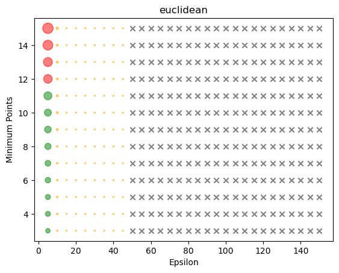
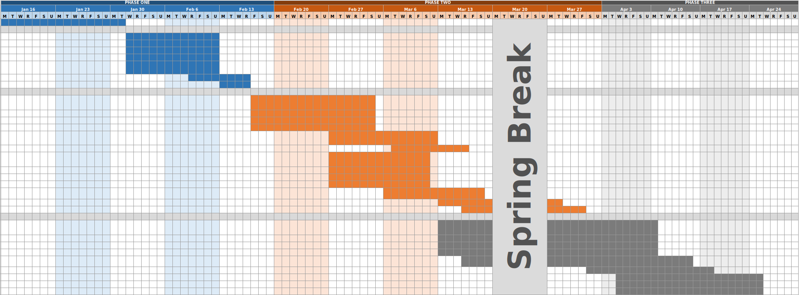

# Music Genre Classification
## Introduction  
More than 81% of Spotify listeners list personalization or discoverability as their favorite feature [[1]](#references). Genre classification is crucial in this recommendation process since genres can represent shared features that comprise a user’s musical preferences. As such, Spotify analyzes both the raw audio files and metadata such as “loudness” or “danceability” to determine a song’s genre [[2]](#references). Classifiers such as K-Nearest Neighbors (KNN), Support Vector Machines (SVM), and Random Forests have commonly been used to conduct genre classification using the metadata [[3]](#references). Others have also attempted converting raw audio files into spectrogram images to be fed into a convolutional neural network (CNN) [[5]](#references).

## Problem Definition  
Despite this, music genre classification remains a challenging task because of the subjective nature of music genres, varying across cultures and time periods, and the wide variety of sub and hybrid genres. The goal of this project is to employ deep learning and K-nearest neighborss in genre classification using Spotify metadata.

## Method  
We will mainly use **neural networks** and **K-nearest neighbors (KNN)** for our project: 
1. Preprocess the data by normalizing the numeric features to a universal scale. Identify outliers using DB-SCAN. Then, the data is split into training, validation, and testing sets.
2. Build the model(s). Select an appropriate architecture, and specify the number and size of the layers. We might use techniques such as dropout to prevent overfitting.
3. Train the model(s). Here, the model will adjust its weights to minimize the categorical cross-entropy loss over the training set, penalizing low probability assignments to the true labels.
4. Evaluate and compare the model(s)’ performance on the testing set. If unsatisfactory, we will tune its hyperparameters and retrain the model until the desired performance is achieved. 

### Data Collection and Duplicate Removal
First, the team created a comprehensive list of genres to be used as classification labels. The genereated list consists of 12 genres: Pop, Hip Hop, Rock, Country, Dance/Electronic, R&B, Metal, Jazz, Reggae, Disco, Folk, Orchestral.

The next step is to generate Spotify playlists of around 500 tracks for each of the chosen genres. Each genre was assigned to a team member who would be responsible for compiling tracks that belong to that genre. The created playlists can be found here: [Pop](https://open.spotify.com/playlist/13Cm1hem9RE4v2ZOMJv34T?si=C9qRRpOQT4-tIqZlzERd6w&app_destination=copy-link), [Hip Hop](https://open.spotify.com/playlist/5K9FlaF7V8Ib4X09rl23w6?si=XnauqM5BTiiqvp88B1bDwA&app_destination=copy-link), [Rock](https://open.spotify.com/playlist/5Wk9TcVaNE5yCyli90HmaR?si=7e1c58897b224157), [Country](https://open.spotify.com/playlist/6hjSKEoPqPLPTt3u0e9bLQ?si=0c844e194b8e467f), [Electronic](https://open.spotify.com/playlist/4ZMSlQbw13hExG4ztynNNV?si=1176e787add3496d), [R&B](https://open.spotify.com/playlist/5WJXKWvPeWA9ubmvVsMTBh?si=YQ0Hnol7Q6S7sivtxHAssA&app_destination=copy-link), [Metal](https://open.spotify.com/playlist/2mDXGVXMG4ZMQaR26iZVC7?si=2beae20751ab4364), [Jazz](https://open.spotify.com/playlist/6GrLcuf2cf8g6h8lkZ0h7H?si=3b460ce380ff4ee6), [Reggae](https://open.spotify.com/playlist/6E5Fr9QU6yAety6Y6pw11u?si=28e0d5583c814bb0), [Disco](https://open.spotify.com/playlist/15X96mpCbP1ZiX8WIBqOhO?si=ba46abbe1146480f), [Folk](https://open.spotify.com/playlist/5fEekkUMaM2Le4FL38UuKx?si=b569e2ad8a264b6b), [Orchestral](https://open.spotify.com/playlist/6HGXewRDu4sH2qy8NYnNba?si=e41039b4ee764d3d).

Next, using the Spotify API and the spotipy library in Python, metadata describing each track’s popularity and audio features was extracted from the Spotify API to be used as features in the classification model. A description of each of these features obtained from the Spotify API [[6]](#references) is portrayed below: 

| Feature | Variable Type | Description |
| --- | ----------- | ---------------|
| Popularity | numeric int | The popularity of the album. The value will be between 0 and 100, with 100 being the most popular. |
| Danceability | numeric float | A measure from 0.0 to 1.0. How suitable a track is for dancing based on a combination of musical elements including tempo, rhythm stability, beat strength, and overall regularity. A value of 0.0 is least danceable and 1.0 is most danceable. |
| Energy | numeric float | A measure from 0.0 to 1.0. Represents a perceptual measure of intensity and activity. Typically, energetic tracks feel fast, loud, and noisy. For example, death metal has high energy, while a Bach prelude scores low on the scale. Perceptual features contributing to this attribute include dynamic range, perceived loudness, timbre, onset rate, and general entropy. |
| Key | categoric int | The key the track is in. Integers map to pitches using standard Pitch Class notation. E.g. 0 = C, 1 = C♯/D♭, 2 = D, and so on. If no key was detected, the value is -1. |
| Loudness | numeric float | The overall loudness of a track in decibels (dB). Loudness values are averaged across the entire track and are useful for comparing relative loudness of tracks. Loudness is the quality of a sound that is the primary psychological correlate of physical strength (amplitude). Values typically range between -60 and 0 db. |
| Mode | categoric int | Indicates the modality (major or minor) of a track, the type of scale from which its melodic content is derived. Major is represented by 1 and minor is 0. |
| Speechiness | numeric float | A measure from 0.0 to 1.0. Detects the presence of spoken words in a track. The more exclusively speech-like the recording (e.g. talk show, audio book, poetry), the closer to 1.0 the attribute value. Values above 0.66 describe tracks that are probably made entirely of spoken words. Values between 0.33 and 0.66 describe tracks that may contain both music and speech, either in sections or layered, including such cases as rap music. Values below 0.33 most likely represent music and other non-speech-like tracks.|
| Acousticness | numeric float | A confidence measure from 0.0 to 1.0 of whether the track is acoustic. 1.0 represents high confidence the track is acoustic. |
| Instrumentalness | numeric float | A measure from 0.0 to 1.0. Predicts whether a track contains no vocals. "Ooh" and "aah" sounds are treated as instrumental in this context. Rap or spoken word tracks are clearly "vocal". The closer the instrumentalness value is to 1.0, the greater likelihood the track contains no vocal content. Values above 0.5 are intended to represent instrumental tracks, but confidence is higher as the value approaches 1.0. |
| Liveliness | numeric float | A measure from 0.0 to 1.0. Detects the presence of an audience in the recording. Higher liveness values represent an increased probability that the track was performed live. A value above 0.8 provides strong likelihood that the track is live. |
| Valence | numeric float | A measure from 0.0 to 1.0 describing the musical positiveness conveyed by a track. Tracks with high valence sound more positive (e.g. happy, cheerful, euphoric), while tracks with low valence sound more negative (e.g. sad, depressed, angry). |
| Tempo | numeric float | The overall estimated tempo of a track in beats per minute (BPM). |
| Duration | numeric int | The duration of the track in milliseconds. |
| Time Signature | categoric int | An estimated time signature. The time signature (meter) is a notational convention to specify how many beats are in each bar (or measure). The time signature ranges from 3 to 7 indicating time signatures of "3/4", to "7/4". |

This information was then compiled into a dataframe, with additional information such as the track name and the main artist. A label was also assigned to each track based on which genre playlist it belongs to. Afterwards, the data was further cleaned by checking for duplicates in the data. There were some cases where duplicates of songs occurred because Spotify may have the same track in different albums. These duplicates were removed from the dataset. There were also cases where the same track or song appeared in more than one genre playlist. This was to be expected since many songs do not fit perfectly into a single genre. To resolve this, a definitive genre was decided for each conflict after listening to the track. As a result of these methods, 134 data points were removed, resulting in a final dataframe of 6100 data points. Each data point was also checked for missing values, and none were found.

### Removing Outliers with DBSCAN
While DBScan worked on the dataset relatively easily, the difficulty lay in finding a good Epsilon and number of minimum points. To aid in tuning the parameters, a helper method `trial_metric` was set up to test how some of Scikit-learn's various metrics affected the results, iterating across a range of values by brute force. Runs which removed <200 songs were bubble-graphed.
 
Through trial and error the Euclidean distance metric with an Epsilon of 5 and minimum Points of 4, based on the following graph:
 

 
The red bubbles represent removed songs - note results < 10 are multiplied by 10 - while blue crosses are runs which didn't remove any outliers.
These values resulted in 1 cluster and removed 37 songs when applied to the dataset. Based on some testing using the Euclidean metric, higher Epsilon values tend towards creating only 1 cluster. Runs which resulted in several clusters would remove over 200 songs, which is a major truncation of the dataset. 

### Exploratory Data Visualization
Below are some visualizations of the data with outliers removed:
<iframe src="Graphs/piechart.html" width="832" height="519"></iframe>

Based on the above pie chart, the removal of 37 songs did not significantly affect the equal representation of genres.

### Normalization

Our dataset consists of numeric and categorical variables. Categorical variables, like key, time signature should be kept as is. Numeric variables are mostly already min-max normalized by Spotify. The only ones left unnormalized are popularity, tempo, and duration(ms). 

3 ways to normalize the data were proposed. 
Min-max: $(X- Xmin)/(X_max - X_min)$. This ensures 0-1 scale. 
Z-score: $(X - mean)/std$. By one sigma from mean, ~68% of data are between 0-1.
Softmax: $softmax(x_i) = e^(x_i) / sum_j(e^(x_j))$. A probability distribution for each class.

For each method, we normalize all numeric variables. It turned out that Z-score was the only normalization method commendable due to higher performance on top of the DB-scanned dataset. 

### Feature Reduction

In order to further process the data before generating the model(s), feature reduction was attempted. As the first step to feature reduction, the correlation matrix between variables was examined. 

<iframe src="Graphs/correlation_matrix_zscore.html" width="832" height="519"></iframe>

As a principle, variables were removed until there are no 2 variables having > 0.6 positive/negative correlation with each other. Under inspection, there were 3 pairs of variables to fix: Loudness and energy, having correlation of 0.81; energy and acousticness, having correlation of -0.78;  loudness and energy, correlation of -0.69. A deliberate decision was made to remove loudness and energy to resolve the 3 pairs. As a result, all collinearity decreased to below 0.6. 

<iframe src="Graphs/correlation_matrix_removed.html" width="832" height="519"></iframe>

This selection of features did not raise performance compared to DB-Scanned data though. The specific performance is reported and compared in the Metrics section. We are in the progress of trying out other feature reduction methods, like PCA and RFE from scikit-learn. We are also examining the validity of forward/backward selection and searching for available packages.

## Potential Results and Discussion

A general baseline can be created for each genre, containing a standard value for each of the features. A song can be tested against these baselines to see how likely it matches with that genre. In addition to this, trends can also be discovered. The year and popularity of each song is recorded and those metrics can reveal trends in the music industry.

Metrics from scikit learn : 
* Accuracy_score : number of correct positives / whole sample  
verifies how accurate the classification model is in correctly identifying the music genres across the whole sample
* Recall_score :  true positives / (true positives + false negatives)  
shows how many genre classifications were predicted correctly out of all correct samples
* Precision_score : true positives / (true positives + false positives)  
reveals how many genre matches were actually of the correct genre, and was not a false positive

## Project Contributors

| Member | Contributions |
| --- | ----------- |
| Ruwei Ma | Normalisation, Feature Reduction, Problem Definition, Discussion |
| Annette Gisella | Data Collection, Duplicate Removal, Feature Reduction, Introduction, Discussion |
| Richard Hoepfinger | Exploratory Data Visualization, Team Communication, Presentation, Discussion |
| Tuan Ha | Neural Network, KNN, Results, Discussion |
| Arthur Odom | Gantt Chart, DBSCAN, Discussion |

## Gantt Chart

<iframe width="1080" height="920" frameborder="0" allowfullscreen="true" src="https://docs.google.com/spreadsheets/d/1l8K8Aj34vmP7cY6OAWpWX1UIrCkKELlk/edit?usp=sharing&ouid=110979405002483791203&rtpof=true&sd=true" title="description"></iframe>

[**Full Gantt Chart**](https://docs.google.com/spreadsheets/d/1l8K8Aj34vmP7cY6OAWpWX1UIrCkKELlk/edit?usp=sharing&ouid=110632432805448997773&rtpof=true&sd=true)

All M2 tasks have 6 days extra, all M3 tasks have 14 days. This is so the schedule doesn't explode the minutes we miss a deadline.

## References

1. [Spotify. (2022, June 8). Spotify Shares Our Vision To Become the World’s Creator Platform. Spotify Newsroom.](https://newsroom.spotify.com/2022-06-08/spotify-shares-our-vision-to-become-the-worlds-creator-platform/)
2. [Tebuev, A. (2022, March 27). Spotify - How data is used to enhance your listening experience. Digital Innovation and Transformation; Harvard Business School.](https://d3.harvard.edu/platform-digit/submission/spotify-how-data-is-used-to-enhance-your-listening-experience/)
3. [Luo, K. (2018). Machine Learning Approach for Genre Prediction on Spotify Top Ranking Songs. https://doi.org/10.17615/j9m1-tz22/](https://doi.org/10.17615/j9m1-tz22/)
4. [Poonia, Sahil & Verma, Chetan & Malik, Nikita. (2022). Music Genre Classification using Machine Learning: A Comparative Study. 13. 15-21.](https://www.researchgate.net/publication/362619781_Music_Genre_Classification_using_Machine_Learning_A_Comparative_Study/)
5. [Wolfewicz, A. (2022, April 21). Deep learning vs. machine learning – What’s the difference? Levity.](https://levity.ai/blog/difference-machine-learning-deep-learning/)
6. [Spotify. (2019). Web API. Spotify for Developers.](https://developer.spotify.com/documentation/web-api/)
